- 

<table>
<colgroup>
<col style="width: 100%" />
</colgroup>
<thead>
<tr class="header">
<th><h1 id="module-3-software-installation-and-data-demultiplexing"><strong>Module 3: Software installation and data demultiplexing</strong></h1></th>
</tr>
</thead>
<tbody>
</tbody>
</table>

## **1. Computational Requirements**
For a complete Single-cell data analysis with atleast 10 samples the computational requirements are as follows:

Memory = 600 - 800 GB

Processor = 4 - 8

Operating System = Linux or MacOS (Windows for Downstream Analysis)

P.S. for this tutorial we will only use a small subset of 4 samples so min of 8 GB RAM and 50-100 GB storage will be enough.

**Storage**

A system having Linux operating system (OS) and with proper network connection is suggested. If Windows is there then, either WSL or any terminal manager like Mobaxterm, Powershell would also work. The RAM requirement depends on the number of samples to be analyzed. 16 GB RAM should be sufficient for an initial analysis. Based on the availability of RAM, analysis time may vary.

To install WSL in your Windows OS, you can refer to the online user guide ([<u>https://learn.microsoft.com/en-us/windows/wsl/install</u>](https://learn.microsoft.com/en-us/windows/wsl/install)) for step by step installation process. Similarly, if interested to use any terminal manager like Mobaxtrem, you can download the software from their official website. ([<u>https://mobaxterm.mobatek.net/download.html</u>](https://mobaxterm.mobatek.net/download.html))

## **2. Tools for Data Analysis**

If you already have miniconda installed then you can start proceeding with the tools installation, and if you do not have miniconda, then you can follow the installation process as mentioned in the Miniconda manual. ([<u>https://www.anaconda.com/docs/getting-started/miniconda/install#linux-terminal-installer</u>](https://www.anaconda.com/docs/getting-started/miniconda/install#linux-terminal-installer))

**Installing Miniconda**

1.  Download the latest version of Miniconda by opening a terminal and running the following commands

```r
 wget https://repo.anaconda.com/miniconda/Miniconda3-latest-Linux-x86_64.sh
```
2.  Install Miniconda

```r
bash Miniconda3-latest-Linux-x86_64.sh 
```

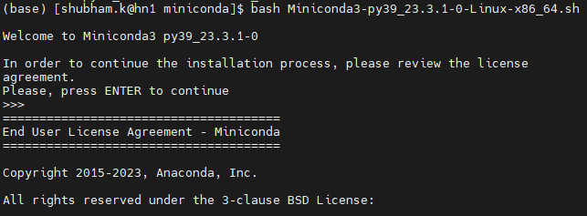

3.  Press Return to review *Miniconda’s End User License Agreement (EULA)*.

4.  Enter yes to agree to the *EULA*.

5.  Press Return to accept the default install location (*PREFIX=/Users/\<USER\>/miniconda3*), or enter another file path to specify an alternate installation directory. The installation might take a few minutes to complete.

6.  Choose an initialization options: yes (recommended)/ no

> 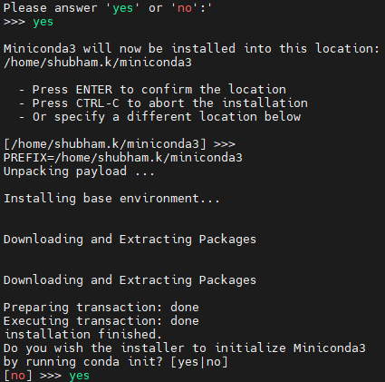

7.  The installer finishes and displays, “Thank you for installing Miniconda3!”

> 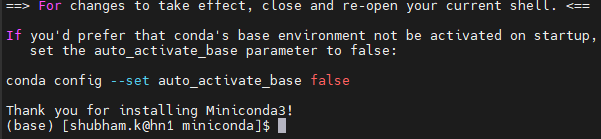

8.  Close and re-open your terminal window for the installation to fully take effect, or use the following command to refresh the terminal. To check if conda installed correctly type

```r
conda --version
```

10.  If restarting the terminal doesn't initiate conda you may need to export the path using following command. Change the path to your conda bin folder.

```r
export PATH="~/miniconda3/bin:$PATH"
```

```r
source ~/.bashrc 
```
To ensure a seamless analysis, we will begin by configuring our workspace by creating and activating a Conda virtual environment, then will proceed with installing the required tools listed below.

```r
conda create --name sc_workshop -y
```

After activating the environment, we will install the following tools in our environment.

| **Tools**                       | **Usage**                                                                                                                                     | **Manual**                                                                                                                                                                                                                                                                                                                                      |
|---------------------------------|-----------------------------------------------------------------------------------------------------------------------------------------------|-------------------------------------------------------------------------------------------------------------------------------------------------------------------------------------------------------------------------------------------------------------------------------------------------------------------------------------------------|
| ***Demultiplexing Tools***      |                                                                                                                                               |                                                                                                                                                                                                                                                                                                                                                 |
| bcl2fastq                       | bcl2fastq Conversion Software both demultiplexes data and converts BCL files generated by Illumina sequencing systems to standard FASTQ file. | [<u>https://support.illumina.com/content/dam/illumina-support/documents/documentation/software_documentation/bcl2fastq/bcl2fastq2-v2-20-software-guide-15051736-03.pdf</u>](https://support.illumina.com/content/dam/illumina-support/documents/documentation/software_documentation/bcl2fastq/bcl2fastq2-v2-20-software-guide-15051736-03.pdf) |
| seqkit                          | A cross-platform and ultrafast toolkit for FASTA/Q file manipulation.                                                                         | [<u>https://bioinf.shenwei.me/seqkit/</u>](https://bioinf.shenwei.me/seqkit/)                                                                                                                                                                                                                                                                   |
| bbmap                           | BBMap is a short read aligner, as well as various other bioinformatic tools.                                                                  | [<u>https://github.com/BioInfoTools/BBMap</u>](https://github.com/BioInfoTools/BBMap)                                                                                                                                                                                                                                                           |
| umi_tools                       | Tools for dealing with Unique Molecular Identifiers (UMIs).                                                                                   | [<u>https://umi-tools.readthedocs.io/en/latest/Single_cell_tutorial.html</u>](https://umi-tools.readthedocs.io/en/latest/Single_cell_tutorial.html)                                                                                                                                                                                             |
| ***Tools for Quality Check***   |                                                                                                                                               |                                                                                                                                                                                                                                                                                                                                                 |
| fastQC                          | A quality control tool for high throughput sequence data.                                                                                     | [<u>https://www.bioinformatics.babraham.ac.uk/projects/fastqc/</u>](https://www.bioinformatics.babraham.ac.uk/projects/fastqc/)                                                                                                                                                                                                                 |
| fastp                           | A ultra-fast FASTQ preprocessor with full features (QC/adapters/trimming/filtering)                                                           | [<u>https://github.com/OpenGene/fastp</u>](https://github.com/OpenGene/fastp)                                                                                                                                                                                                                                                                   |
| Trimmomatic                     | A flexible read trimming tool for Illumina NGS data.                                                                                          | [<u>http://www.usadellab.org/cms/?page=trimmomatic</u>](http://www.usadellab.org/cms/?page=trimmomatic)                                                                                                                                                                                                                                         |
| ***Data Pre-processing Tools*** |                                                                                                                                               |                                                                                                                                                                                                                                                                                                                                                 |
| samtools                        | Tools for dealing with SAM, BAM and CRAM files                                                                                                | [<u>https://www.htslib.org/doc/#manual-pages</u>](https://www.htslib.org/doc/#manual-pages)                                                                                                                                                                                                                                                     |
| subread                         | High-performance read alignment, quantification, and mutation discovery.                                                                      | [<u>https://subread.sourceforge.net/</u>](https://subread.sourceforge.net/subread.html)                                                                                                                                                                                                                                                         |
| STAR                            | An RNA-seq read aligner.                                                                                                                      | [<u>https://physiology.med.cornell.edu/faculty/skrabanek/lab/angsd/lecture_notes/STARmanual.pdf</u>](https://physiology.med.cornell.edu/faculty/skrabanek/lab/angsd/lecture_notes/STARmanual.pdf)                                                                                                                                               |

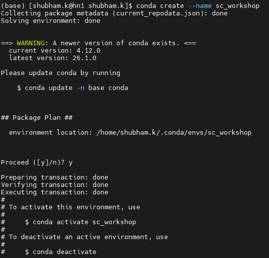

```r
conda activate sc_workshop
```

## **3. Installing tools using conda**

To install the above mentioned tools using conda, you can install it via:

```r
conda install -y -c dranew -c bioconda bcl2fastq seqkit bbmap umi_tools trimmomatic samtools star subread
```

**NOTE*:*** *While installing umi_tools, one can encounter some dependency issues related to the python version in the environment. Therefore, to resolve that you can create a new environment and install umi_tools separately in that environment.*

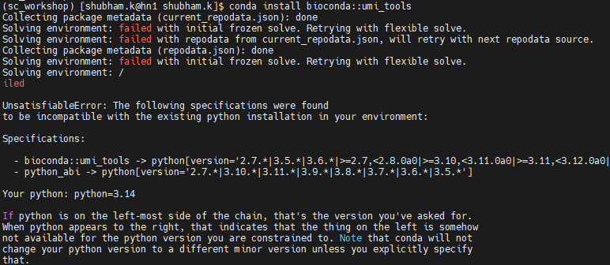

## **4. Basics of Linux and Common Commands**

The Linux Shell, a Command-Line Interface (CLI), allows users to automate repetitive tasks rapidly and accurately. It enables powerful scripting, combining tools into robust pipelines, handling large datasets, and interacting with remote servers and supercomputers, making it an essential skill for advanced computing.

**Basic Commands**

<table>
<colgroup>
<col style="width: 17%" />
<col style="width: 51%" />
<col style="width: 30%" />
</colgroup>
<thead>
<tr class="header">
<th><strong>Command</strong></th>
<th><strong>Usage</strong></th>
<th><strong>Example</strong></th>
</tr>
<tr class="odd">
<th colspan="3"><em><strong>Navigation Commands</strong></em></th>
</tr>
<tr class="header">
<th>cd</th>
<th>Change directory; special shortcuts: .. (up one level), ~ (home directory)</th>
<th><p>cd &lt;dir&gt;</p>
<p>cd ../</p></th>
</tr>
<tr class="odd">
<th>ls</th>
<th>List files and directories; options: -l (detailed), -a (all files including hidden)</th>
<th><p>ls</p>
<p>ls –l</p></th>
</tr>
<tr class="header">
<th>pwd</th>
<th>Print current directory path</th>
<th>pwd</th>
</tr>
<tr class="odd">
<th colspan="3"><em><strong>Managing Files and Directories</strong></em></th>
</tr>
<tr class="header">
<th>mkdir</th>
<th>Create a new directory to organize your files</th>
<th>mkdir &lt;workshop&gt;</th>
</tr>
<tr class="odd">
<th>cp</th>
<th>Copy files or directories to a new location</th>
<th>cp &lt;source&gt; &lt;dest&gt;</th>
</tr>
<tr class="header">
<th>mv</th>
<th>Move or rename files and directories</th>
<th>mv &lt;old&gt; &lt;new&gt;</th>
</tr>
<tr class="odd">
<th colspan="3"><em><strong>Viewing and Editing File Contents</strong></em></th>
</tr>
<tr class="header">
<th>cat</th>
<th>Display entire file content</th>
<th>cat &lt;file&gt;</th>
</tr>
<tr class="odd">
<th>head</th>
<th>Show first 10 lines by default</th>
<th>head &lt;file&gt;</th>
</tr>
<tr class="header">
<th>tail</th>
<th>Show last 10 lines by default</th>
<th>tail &lt;file&gt;</th>
</tr>
<tr class="odd">
<th>grep</th>
<th>Search for text patterns inside files</th>
<th>grep &lt;pattern&gt; &lt;file&gt;</th>
</tr>
<tr class="header">
<th>nano / vim</th>
<th>Create an empty file or editing an existing file</th>
<th><p>nano &lt;file_name&gt;</p>
<p>vim &lt;file_name&gt;</p></th>
</tr>
<tr class="odd">
<th colspan="3"><em><strong>Counting Words, Lines, and Characters</strong></em></th>
</tr>
<tr class="header">
<th>wc</th>
<th><p>It can count lines, words, and characters in one or more files.</p>
<p>Options : -l (count lines), -w (count words), -c (count characters)</p></th>
<th><p>wc &lt;file&gt; or</p>
<p>wc [options] &lt;file&gt;</p></th>
</tr>
</thead>
<tbody>
</tbody>
</table>

## **5. Transfer of Data from Sequencing Machine to Server**

```r
rsync –avP \<PATH/TO/RAW/RUN/READS/DIR\> \<PATH/TO/YOUR/WORKING/DIR/\>
```

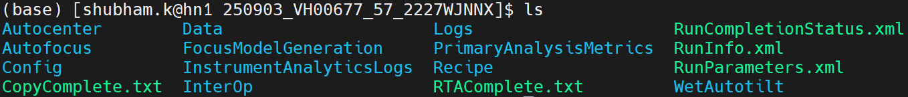

## **6. Basecalling and Demultiplexing**

Basecalling algorithms process the raw signal to decode the sequence of bases within strands of DNA or RNA into data stored in BAM or FASTQ files. Demultiplexing is the computational unwinding of the pooled sequencing data. It uses the sample-specific index sequences to sort a single massive data stream into individual, sample-specific FASTQ files, allowing for independent downstream analysis.

**bcl2fastq**

```r
bcl2fastq \
  --use-bases-mask=Y85,I8,I8,Y215 \
  --create-fastq-for-index-reads \
  --minimum-trimmed-read-length=8 \
  --mask-short-adapter-reads=8 \
  --ignore-missing-filter \
  --ignore-missing-bcls \
  –p 6 \
  -R </PATH/TO/YOUR/RUN/FOLDER/DIR> \
  --output-dir </PATH/WHERE/YOU/WANT/TO/SAVE/FASTQ/FILES> \
  --interop-dir </PATH/TO/YOUR/RUN/FOLDER/DIR/InterOp>\
  --sample-sheet </PATH/TO/SAMPLE_SHEET.csv>
```

<table>
<colgroup>
<col style="width: 53%" />
<col style="width: 46%" />
</colgroup>
<thead>
<tr class="header">
<th colspan="2"><strong>bcl2fastq Parameters</strong></th>
</tr>
<tr class="odd">
<th><em><strong>Parameter</strong></em></th>
<th><em><strong>Usage</strong></em></th>
</tr>
<tr class="header">
<th>-i [ --input-dir ]</th>
<th>path to input directory</th>
</tr>
<tr class="odd">
<th>-R [ --runfolder-dir ]</th>
<th>path to runfolder directory</th>
</tr>
<tr class="header">
<th>--intensities-dir</th>
<th><p>path to intensities directory</p>
<p>(If intensities directory is specified, --input-dir must also be specified.)</p></th>
</tr>
<tr class="odd">
<th>-o [ --output-dir ]</th>
<th>path to demultiplexed output</th>
</tr>
<tr class="header">
<th>--sample-sheet</th>
<th>path to the sample sheet</th>
</tr>
<tr class="odd">
<th>-p [ --processing-threads ]</th>
<th>number of threads used for processing demultiplexed data</th>
</tr>
<tr class="header">
<th>--use-bases-mask</th>
<th>specifies how to use each cycle.</th>
</tr>
<tr class="odd">
<th>--interop-dir</th>
<th>path to demultiplexing statistics directory</th>
</tr>
<tr class="header">
<th>--minimum-trimmed-read-length</th>
<th>minimum read length after adapter trimming</th>
</tr>
<tr class="odd">
<th>--mask-short-adapter-reads</th>
<th>smallest number of remaining bases (after masking bases below the minimum trimmed read length) below which whole read is masked</th>
</tr>
<tr class="header">
<th>--create-fastq-for-index-reads</th>
<th>create FASTQ files also for index reads</th>
</tr>
<tr class="odd">
<th>--ignore-missing-filter</th>
<th>assume 'true' for missing filters</th>
</tr>
<tr class="header">
<th>--ignore-missing-bcls</th>
<th>assume 'N'/'#' for missing calls</th>
</tr>
</thead>
<tbody>
</tbody>
</table>

The reads obtained after demultiplexing will be in FATSQ format from the experiment including Read1(R1) and Read2(R2) files for the Whole Transcriptome Analsysis (WTA) RNA library, Sample Tag and BD® AbSeq libraries.

The assays are used to create sequencing libraries from single-cell multiomic experiments. R1 reads contain information on the cell label and molecular identifier, whereas, R2 reads contain information on the bioproduct.


Sample Multiplexing Tag are paired end FASTQ files are used to identify which sample a specific cell belongs to.

R1 consists of a cell barcode sequence and Unique Molecular Identifier(UMI) sequence to identify the individual molecule to ensure accurate counting and minimizing the bias. R2 contains the specific Sample Tag sequence (an oligonucleotide barcode) that is used to identify which sample the cell in R1 belongs to.

In WTA, paired end reads (R1 and R2) have distinct purposes to identify cells and their gene expression. R1 contains the cell barcodes and the UMI, to identify which specific cell the sequences came from, whereas, the R2 contains the cDNA sequence information i.e the actual RNA content which is used to map the sequence to a specific gene or transcript in the transcriptome.

To extract each sample from a mixed pooled library we will first extract the sample tag sequence from the SMK_R2 file, and for that we will use the seqkit tool.

**seqkit grep**
```r
seqkit grep -s –j 8 -p “<SAMPLE TAG SEQUENCE>” <SMK_R2.fastq.gz> > <output_R2.fastq>
```

**Example:**
```r
seqkit grep -s -j 20 -p "ATTCAAGGGCAGCCGCGTCACGATTGGATACGACTGTTGGACCGG" WTA_B4_S1_R2_001.fastq.gz > SMK1_R2.fastq
```

| **seqkit grep Parameters** |                     |                                                                                                                              |
|----------------------------|---------------------|------------------------------------------------------------------------------------------------------------------------------|
| ***Parameter***            | ***Argument type*** | ***Usage***                                                                                                                  |
| -s, --by-seq               |                     | search subseq on seq. Both positive and negative strand are searched by default, you might use -P/--only-positive-strand.    |
| -p, --pattern              | strings             | search pattern. Multiple values supported: comma-separated (e.g., -p, "p1,p2") OR use -p multiple times (e.g., -p p1 -p p2). |
| -j, --threads              | int                 | number of CPUs. (default 4)                                                                                                  |

You can verify whether the sequences are getting extracted correctly or not by using AliView, an alignment viewer and editor, but this is probably one of the fastest. To know more about the software, you can visit the GitHub page ([<u>https://github.com/AliView/AliView</u>](https://github.com/AliView/AliView)).

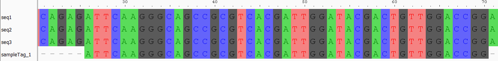

Another way to verify your sequence is using CLI, and for that you can use grep command.

```r
| zcat <output_R2.fastq.gz | grep “<SAMPLE TAG PATTERN>” | head 
```

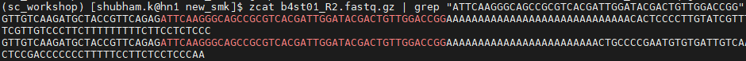

Next, we need to extract the corresponding SMK_R1 reads from the SMK_R2 for a specific sample, which contains our cell barcode and UMI reads. To do that first we need to extract the read Ids from the SMK_R2 file and match it with SMK_R1.

**Extract Read Ids using zcat**

```r
| gzip <output_R2.fastq>
```
```r
| zcat <output_R2.fastq.gz> | awk 'NR%4==1 {sub(^@,""); print $1}' > <output_readIds.txt
```

**Example:**

```r
| zcat SMK1_R2.fastq | awk 'NR%4==1 {sub(^@,""); print $1}' > SMK1_readIds.txt 
```

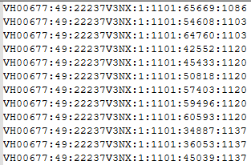

After extracting the read ids, we will use it to match with the SMK_R1, and for that we use filterbyname.sh script from bbmap tool.

**filterbyname.sh**

```r
| filterbyname.sh in=<SMK_R1.fastq.gz> out=<output_R1.fastq.gz> names=<string, txt, fastq, fasta> include=<t/f> substring=<t/f>
```

**Example:**

```r
filterbyname.sh \
in=WTA_B4_S1_R1_001.fastq.gz \
out=SMK1_R1.fastq.gz \
names=SMK1_readIds.txt \
include=t substring=f
```

<table>
<colgroup>
<col style="width: 24%" />
<col style="width: 75%" />
</colgroup>
<thead>
<tr class="header">
<th colspan="2"><strong>filterbyname.sh Parameters</strong></th>
</tr>
<tr class="odd">
<th><em><strong>Parameter</strong></em></th>
<th><em><strong>Usage</strong></em></th>
</tr>
<tr class="header">
<th>Include=f</th>
<th>Set to 'true' to include the filtered names rather than excluding them.</th>
</tr>
<tr class="odd">
<th>substring=f</th>
<th><p>Allow one name to be a substring of the other, rather than a full match.</p>
<ol type="i">
<li><blockquote>
<p>f: No substring matching.</p>
</blockquote></li>
<li><blockquote>
<p>t: Bidirectional substring matching.</p>
</blockquote></li>
</ol></th>
</tr>
<tr class="header">
<th>names=</th>
<th>A list of strings or files. The files can have one name per line, or be a standard read file.</th>
</tr>
</thead>
<tbody>
</tbody>
</table>

**SMK_R1.fastq.gz**

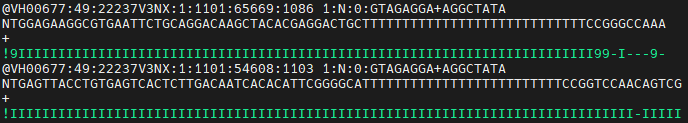

After you extract the SMK_R1, it is necessary to check whether reads have been properly extracted or not. So, to do that, you can check the total read count in both SMK_R2.fastq.gz and SMK_R1.fastq.gz and both the reads should have the same read count.

Once, we get both the sample tag reads (R1 and R2), now comes the crucial part which is generating the whitelist for our sample. Whitelist is a list of known, valid, and error-corrected cell barcode sequences (cell labels) that are attached to the beads used to capture RNA.

BD Rhapsody barcodes consist of three distinct regions (Cell Label Section 1, 2, and 3, or CLS1, CLS2, CLS3). The whitelist is specific to the version of the beads used in the experiment. (Original V1 or Enhanced 3’)

**umi_tools whitelist**

```r
umi_tools whitelist –I <SMK_R1.fastq.gz> <OPTIONS>
```

**Example:**

```r
umi_tools whitelist \
--stdin SMK1_R1.fastq.gz \
--bc-pattern="(?P<cell_1>.{9,12})(?P<discard_1>GTGA)(?P<cell_2>.{9})(?P<discard_1>GACA)(?P<cell_3>.{9})(?P<umi_1>.{8})T{8,24}.*" \
--set-cell-number=7000 \
--extract-method=regex \
--plot-prefix \
--log2stderr > whitelist_st1.txt
```

| **umi_tools whitelist Parameters** |                                                                            |
|------------------------------------|----------------------------------------------------------------------------|
| ***Parameter***                    | ***Usage***                                                                |
| -I , --stdin                       | file to read stdin from \[default = stdin\].                               |
| -p, --bc-pattern=                  | Barcode pattern                                                            |
| --set-cell-number=                 | Specify the number of cell barcodes to accept.                             |
| --extract-method=                  | How to extract the umi +/- cell barcodes, Choose from 'string' or 'regex'. |

**Whitelist Pattern**

We will be using a regular expression (regex) with a named capture group to extract the sequencing reads for whitelist generation (cell barcodes + UMI extraction). The expression has the following structure:

| \[CL1\]\[GTGA\]\[CL2\]\[GACA\]\[CL3\]\[UMI\]\[polyT\]\[capture sequence\] |
|---------------------------------------------------------------------------|

| *(?P\<CL1\>.{9,12})(?P\<discard_1\>GTGA)(?P\<CL2\>.{9})(?P\<discard_1\>GACA)(?P\<CL3\>.{9})(?P\<UMI\>.{8})T{8,24}.\** |
|-----------------------------------------------------------------------------------------------------------------------|

- ***(?P\<cell_1\>.{9,12})*** : This is a named capture group with variable as cell_1. It captures the first cell barcode segment which is of variable length (9-12 bases) and stores it as cell_1.

- ***(?P\<discard_1\>GTGA)***: It matches an exact sequence “GTGA” and saves it as discard. This is a constant linker/anchor sequence separating barcode blocks.

- ***(?P\<cell_2\>.{9})***: This captures the second cell barcode sequence of length exactly 9 bases.

- ***(?P\<discard_1\>GACA)***: It is used to capture the exact sequence “GACA” as this is also a linker sequence between cell barcodes.

- ***(?P\<cell_3\>.{9})***: It captures the third cell barcode sequence of exactly 9 bases.

- ***(?P\<umi_1\>.{8})***: This captures the unique molecular identifier of 8 bases and is labelled as umi_1.

- ***T{8,24}***: This corresponds to the poly-T stretch which is used to capture mRNA. It matches the variable length of 8 to 24 consecutive T bases.

You can check the whitelist.txt to ensure the number of cells which have been truly captured on the basis of the pattern used for generating the list.

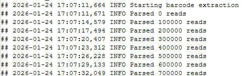

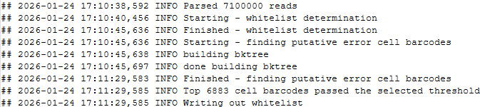

From the above screenshot, one can see that *<u>6883 cell barcodes</u>* have been captured for a specific sampleID_1.

Next, after generating the whitelist we will now proceed with the extraction of the actual RNA content from the WTA paired reads. To do that, first we need to map our whitelist with the WTA_R1 and then using that we will extract the respective WTA_R2. Hence, to ease out this 2 step process, we will use another function of umi_tools, umi_tools extract.

**umi_tools extract**

```r
umi_tools extract \
--std <WTA_R1.fastq.gz>; \
--stdout <WTA_output_R1.fastq.gz> \
-p <PATTERN> \
--read2-in <WTA_R2.fastq.gz>; \
--read2-out <WTA_output_R2.fastq.gz> 
```

**Example:**

```r
umi_tools extract \
--extract-method=regex \ 
--bc-pattern="(?P&lt;cell_1&gt;.{9,12})(?P&lt;discard_1&gt;GTGA)(?P&lt;cell_2&gt;.{9})(?P&lt;discard_1&gt;GACA)(?P&lt;cell_3&gt;.{9})(?P&lt;umi_1&gt;.{8})T{8,24}.*" \
--stdin WTA_B4_S1_R1_001.fastq.gz \
--stdout WTA_SAMPLE1_R1.fastq.gz \
--read2-in WTA_B4_S1_R2_001.fastq.gz \
--read2-out WTA_SAMPLE1_R2.fastq.gz \
--whitelist=whitelist_st1.txt
```

| **umi_tools extract Parameters** |                                                                            |
|----------------------------------|----------------------------------------------------------------------------|
| ***Parameter***                  | ***Usage***                                                                |
| -I , --stdin=                    | file to read stdin from \[default = stdin\].                               |
| -S , --stdout=                   | file where output is to go \[default = stdout\].                           |
| -p, --bc-pattern=                | Barcode pattern                                                            |
| --read2-in=                      | file name for read pairs                                                   |
| --read2-out=                     | file to output processed paired read to                                    |
| --whitelist=                     | A whitelist of accepted cell barcodes                                      |
| --extract-method=                | How to extract the umi +/- cell barcodes, Choose from 'string' or 'regex'. |

**WTA_R1.fastq.gz**

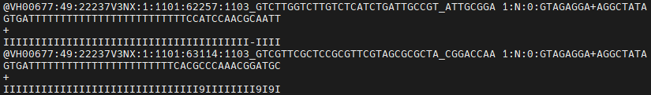

**WTA_R2.fastq.gz**


**Note:** *The whitelist generated at this step will also be used for the alignment using STAR (Module 4).*
