<table>
<colgroup>
<col style="width: 100%" />
</colgroup>
<thead>
<tr class="header">
<th><h1 id="module-4-preprocessing-and-alignment-of-scrna-seq-data"><strong>Module 4: Preprocessing and Alignment of scRNA-Seq Data</strong> </h1></th>
</tr>
</thead>
<tbody>
</tbody>
</table>

## **1. Overview of the Workflow**


| FASTQ -> QC -> Whitelist -> UMI Extraction -> STAR -> featureCounts -> UMI Count |
|----------------------------------------------------------------------------------|

## **2. Quality Filtering using fastp**

Before proceeding to barcode processing and alignment, it is essential to evaluate and clean the sequencing reads. Although modern sequencers produce high-quality data, technical artifacts such as low-quality bases and very short reads may still be present. Removing such artifacts improves downstream alignment performance and reduces noise.

In single-cell RNA-seq:

- Read 1 (R1) contains Cell Barcode + UMI

- Read 2 (R2) contains transcript sequence

The cell barcodes are unique sequences which help us identify cells and tag them from our samples, whereas UMI helps us tag every RNA molecule uniquely. Care must be taken not to aggressively trim R1, as it contains structured barcode information.

**fastp command**

```r
fastp \
--in1 /path/to/read1/input/file/<WTA_SAMPLE1_R1.fastq.gz> \
--in2 /path/to/read2/input/file/<WTA_SAMPLE1_R2.fastq.gz> \
--out1 /path/to/<WTA_SAMPLE1_R1.fastp.fastq.gz> \
--out2 /path/to/<WTA_SAMPLE1_R2.fastp.fastq.gz> \
--length_required 20 \
--qualified_quality_phred 15 \
--thread 12 \
--html /logs/WTA_fastp.html \
--json /logs/WTA_fastp.json
```

| **fastp Parameters**         |                                                     |
|------------------------------|-----------------------------------------------------|
| ***Parameter***              | ***Description***                                   |
| --in1                        | Input FASTQ file for Read 1 (Cell Barcode + UMI)    |
| --in2                        | Input FASTQ file for Read 2 (Transcript read)       |
| --out1                       | Output cleaned Read 1 file                          |
| --out2                       | Output cleaned Read 2 file                          |
| --length_required 20         | Discards reads shorter than 20 bases after trimming |
| --qualified_quality_phred 15 | Bases below Q15 are considered low quality          |
| --thread 12                  | Number of CPU threads used                          |
| --html                       | Generates interactive quality control report        |
| --json                       | Generates machine-readable summary statistics       |

### 

### 

### 

### 

**Why Use Q15?**

In bulk RNA-seq, stricter thresholds (Q20 or Q30) are often used. However, in single-cell RNA-seq, over-trimming can remove biologically relevant reads while some reads may be shorter due to fragmentation. Therefore, a slightly permissive threshold preserves sensitivity.

**Evaluating fastp result**

After execution, summary statistics can be extracted from the json report:

```r
grep "total_reads" <WTA_fastp.json>
grep "q20_rate" <WTA_fastp.json>
```

**Output generated:**

The HTML report can be opened in a browser for detailed visualization of per-base quality, Adapter content, GC distribution and Sequence duplication levels.

**Note:** *For this study we have used sample b13st2.*

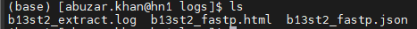

Quality filtering ensures that the barcode extraction is reliable and improves alignment accuracy.

Importantly, we avoid aggressive trimming to preserve cell barcode and UMI sequences that are present in the reads.

**Total Reads**

> Initial reads: **100,364,778**
> Post-filtering reads: **100,363,522**

**Understanding the fastp HTML Report**

After running fastp, an interactive quality control report is generated. This report helps us evaluate sequencing quality before alignment. The HTML report also shows per-base quality plots for Read 1 and Read 2.

**What These Plots Show**

- X-axis → position in read

- Y-axis → quality score

- Black line → mean quality


In our sample, R1 shows high quality in early positions, followed by a slight drop near the end (expected in scRNA-seq), whereas R2 shows gradual decline toward 3′ end (normal).

***NOTE:** A gradual quality drop at the end of reads is normal, while sudden sharp drop early in the read would be concerning.*

***Read 1*** quality before and after filtering as depicted below:

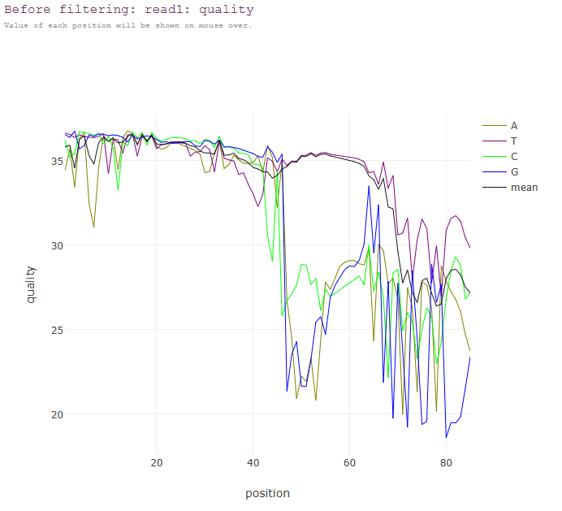  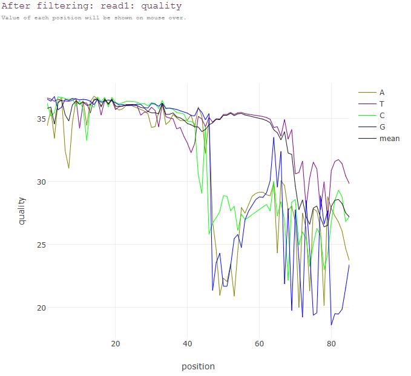

***Read 2*** quality before and after filtering as depicted below:

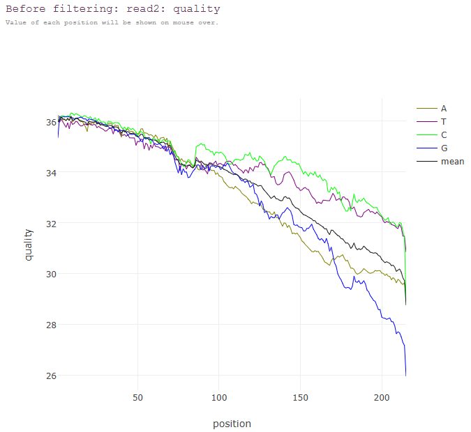  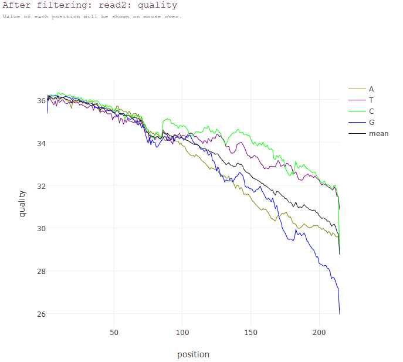

**\# Final Quality Assessment**

This dataset shows high base quality with Q30 values above 80%, with minimal adapter contamination and low duplication rate.

## **3. Alignment using STAR**

**Reference Genome and Annotation Preparation**

Before performing alignment, a reference genome and corresponding gene annotation file are required.

STAR uses:

- **Genome FASTA** → for sequence alignment

- **GTF annotation file** → for splice junction and gene feature information

It is critical that both files originate from the **same release version** to avoid coordinate mismatches during gene assignment.

In this module, we use (GENCODE Release 49, GRCh38 primary assembly)

**Downloading the Reference Files**

### **Genome FASTA**

```r
wget -P /path/to/fasta \
https://ftp.ebi.ac.uk/pub/databases/gencode/Gencode_human/release_49/GRCh38.primary_assembly.genome.fa.gz
gunzip /path/to/GRCh38.primary_assembly.genome.fa.gz
```

**Example Command**

```r
wget -P ../reference/fasta \
https://ftp.ebi.ac.uk/pub/databases/gencode/Gencode_human/release_49/GRCh38.primary_assembly.genome.fa.gz
gunzip ../reference/fasta/GRCh38.primary_assembly.genome.fa.gz
```

**Gene Annotation (GTF)**

```r
wget -P /path/to/gtf \
https://ftp.ebi.ac.uk/pub/databases/gencode/Gencode_human/release_49/gencode.v49.annotation.gtf.gz
gunzip /path/to/gencode.v49.annotation.gtf.gz
```

**Example Command**

```r
wget -P ../reference/gtf \
https://ftp.ebi.ac.uk/pub/databases/gencode/Gencode_human/release_49/gencode.v49.annotation.gtf.gz
gunzip ../reference/gtf/gencode.v49.annotation.gtf.gz
```

# 

# **Building the STAR Genome Index**

Before aligning sequencing reads, STAR requires a pre-built genome index. The genome index is a searchable data structure derived from reference genome FASTA file and gene annotation (GTF) file

This index enables:

- Fast alignment

- Accurate splice junction detection

- Efficient memory usage during alignment

**Note:** *Genome indexing is performed **only once per genome build** and reused for all samples. It important that FASTA and GTF must originate from the same release*

**Indexing**

```r
STAR \
--runThreadN 12 \
--runMode genomeGenerate \
--genomeDir /path/to/star_index \
--genomeFastaFiles /path/to/fasta/GRCh38.primary_assembly.genome.fa \
--sjdbGTFfile /path/to/gtf/gencode.v49.annotation.gtf \
--sjdbOverhang 149
```

**Example Indexing command**

```r
STAR \
--runThreadN 12 \
--runMode genomeGenerate \
--genomeDir ../reference/star_index \
--genomeFastaFiles ../reference/fasta/GRCh38.primary_assembly.genome.fa \
--sjdbGTFfile ../reference/gtf/gencode.v49.annotation.gtf \
--sjdbOverhang 149
```

| **STAR Parameters (for creating Genome Index)** |                                                            |
|-------------------------------------------------|------------------------------------------------------------|
| ***Parameter***                                 | ***Description***                                          |
| --runThreadN 12                                 | Number of CPU threads used for indexing                    |
| --runMode genomeGenerate                        | Tells STAR to build genome index instead of aligning reads |
| --genomeDir                                     | Directory where index files will be stored                 |
| --genomeFastaFiles                              | Reference genome FASTA file                                |
| --sjdbGTFfile                                   | Gene annotation file (must match genome version)           |
| --sjdbOverhang 149                              | Read length − 1 (for 150 bp reads)                         |

**Why Use --sjdbOverhang 149?**

If sequencing read length is 150 bp:

*150−1=149*

This parameter improves splice junction detection by informing STAR of the maximum read overhang across exon junctions. Using the correct value improves alignment accuracy for spliced transcripts.

**Output Files Generated**

After successful indexing, the following directory is created: “reference/star_index/” in the example.

| ls ../reference/star_index/ |
|-----------------------------|

**Expected output:**

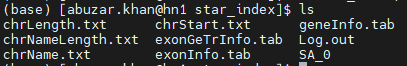

The generated files include:

- **Genome** → Encoded reference genome

- **SA / SAindex** → Suffix array structures for fast searching

- **sjdbList.fromGTF.out.tab** → Splice junction database

- **transcriptInfo.tab** → Transcript-level metadata

These files collectively form the STAR genome index. The total directory size is typically:

~30–35 GB for GRCh38 primary assembly This confirms successful genome indexing and integration of annotation into index.

**Alignment of Transcript Reads Using STAR**

After extracting valid transcript reads (R2) and attaching cell barcode and UMI information to the read headers, the next step is to align these reads to the human reference genome.

In BD Rhapsody data

- R1 contains barcode and UMI (already processed)

- R2 contains transcript sequence and is used for alignment

**Note:** We will be using the whitelist generated previously in Module 1 using umi tools in the following steps of Alignment. Kindly refer to Module 1 for detailed steps along with codes if your data requires Whitelist file generation after demultiplexing.

**STAR Alignment**

```r
STAR \
--runThreadN 12 \
--genomeDir </Path/to/star_index> \
--readFilesIn <R2_fastq.gz> \
--readFilesCommand zcat \
--outFileNamePrefix <sample_name> \
--outSAMtype BAM SortedByCoordinate \
--twopassMode Basic \
--outFilterScoreMinOverLread 0.3 \
--outFilterMatchNminOverLread 0.3 \
--clip3pAdapterSeq AAAAAA \
--limitBAMsortRAM 60000000000
```

**Example Star Alignment** :

```r
STAR \
--runThreadN 12 \
--genomeDir /lustre/abuzar.khan/scRNAseq/reference_genome/STAR_index_GRCh38_Fixed \
--readFilesIn ../results/extracted/b13st2_R2_extracted.fastq.gz \
--readFilesCommand zcat \
--outFileNamePrefix ../results/star/b13st2/ \
--outSAMtype BAM SortedByCoordinate \
--twopassMode Basic \
--outFilterScoreMinOverLread 0.3 \
--outFilterMatchNminOverLread 0.3 \
--clip3pAdapterSeq AAAAAA \
--limitBAMsortRAM 60000000000
```

| **STAR Parameters (for alignment)** |                                                  |
|-------------------------------------|--------------------------------------------------|
| ***Parameter***                     | ***Description***                                |
| --runThreadN 12                     | Number of CPU threads used for alignment         |
| --genomeDir                         | Path to previously built STAR genome index       |
| --readFilesIn                       | Input transcript FASTQ file (R2)                 |
| --readFilesCommand zcat             | Decompress gzipped FASTQ on-the-fly              |
| --outFileNamePrefix                 | Directory and prefix for output files            |
| --outSAMtype BAM SortedByCoordinate | Output sorted BAM file directly                  |
| --twopassMode Basic                 | Improves splice junction detection               |
| --outFilterScoreMinOverLread 0.3    | Relaxed alignment score threshold                |
| --outFilterMatchNminOverLread 0.3   | Relaxed minimum matched bases threshold          |
| --clip3pAdapterSeq AAAAAA           | Clips polyA tails at 3′ end                      |
| --limitBAMsortRAM                   | Prevents excessive memory use during BAM sorting |

**Why Use Two-Pass Mode? (Optional )**

--twopassMode Basic allows STAR to:

- Perform initial alignment

- Detect novel splice junctions

- Re-align reads using improved splice database

This improves mapping accuracy in RNA-seq datasets and is useful for detecting novel splice junctions.

**Evaluating Alignment Quality**

**To extract key alignment statistics:**

```r
grep "Number of input reads" ../path/to/b13st2/Log.final.out
grep "Uniquely mapped reads %" ../path/to/b13st2/Log.final.out
```

**Example code:**

```r
grep "Number of input reads" ../results/star/b13st2/Log.final.out
grep "Uniquely mapped reads %" ../results/star/b13st2/Log.final.out
```

**Example Output:**

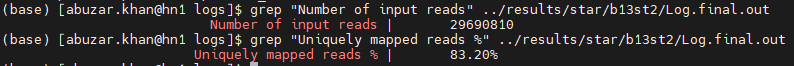

### **Number of Input Reads**

This value should match the number of extracted transcript reads from the previous step. Consistency in the transcript reads count signifies no data loss during alignment.

**Uniquely Mapped Reads %**

For scRNA-seq data:

- 65–85% unique mapping is typical

- 70% is considered good

- Lower values may indicate contamination or reference mismatch

A mapping rate of ~80% suggests high alignment along with effective preprocessing.

## **4. Assigning Aligned Reads to Transcripts Using featureCounts**

After aligning reads to the reference genome, the next step is to determine which transcript (or gene) each aligned read belongs to. This process is called **feature assignment**.

We use featureCounts to assign reads to transcript features along with adding gene/transcript tags into the BAM file and preparing data for UMI-based deduplication.

**featureCounts Command**

```r
featureCounts \
-a ../path/to/gencode.v49.annotation.gtf \
-o ../path/to/b13st2/transcript_stats.txt \
-R BAM \
-T 12 \
-t exon \
-g transcript_id \
-O -M --fraction \
/path/to/b13st2/Aligned.sortedByCoord.out.bam
```

**Example featureCounts Command**

```r
featureCounts \
-a ../reference/gtf/gencode.v49.annotation.gtf \
-o ../results/star/b13st2/transcript_stats.txt \
-R BAM \
-T 12 \
-t exon \
-g transcript_id \
-O -M --fraction \
../results/star/b13st2/Aligned.sortedByCoord.out.bam
```

The featureCounts-modified BAM is renamed, sorted, and indexed to prepare it for UMI-based transcript counting.

```r
mv Aligned.sortedByCoord.out.bam.featureCounts.bam assigned_transcript.bam
samtools sort -o final_transcript_sorted.bam assigned_transcript.bam
samtools index final_transcript_sorted.bam
```

| **Parameter**    | **Description**                            |
|------------------|--------------------------------------------|
| -a               | Annotation (GTF) file                      |
| -o               | Output count statistics file               |
| -R BAM           | Writes transcript assignment into BAM tags |
| -T 12            | Number of CPU threads                      |
| -t exon          | Count reads overlapping exon features      |
| -g transcript_id | Group reads by transcript ID               |
| -O               | Allow reads overlapping multiple features  |
| -M               | Allow multi-mapping reads                  |
| --fraction       | Distribute multi-mapped reads fractionally |

## 

**featureCounts Summary**

From the log file:

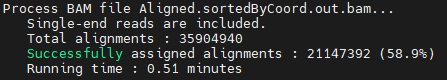

**Interpretation of Key Terms**

- **Total alignments  
  > **Total number of aligned reads provided to featureCounts.

- **Successfully assigned alignments  
  > **Reads that overlapped annotated exon regions and were assigned to a transcript.

- **58.9% assignment rate** means nearly 59% of aligned reads map to annotated exons while the remaining reads may map to intronic regions or map ambiguously.

**Output Files Generated**

**Transcript Count File Preview**

| head -n 10 /path/to/b13st2/transcript_stats.txt |
|-------------------------------------------------|

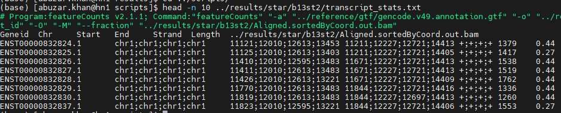Each row represents one transcript, associated genomic coordinates and the number of reads assigned.

## **5. UMI-Based Deduplication and Final Transcript–Cell Count Matrix**

In single-cell RNA-seq, PCR amplification introduces duplicate reads originating from the same original RNA molecule. If not corrected, these duplicates will artificially inflate expression values and may distort cell clustering introducing bias in downstream differential expression analysis. Unique Molecular Identifiers (UMIs) allow us to collapse PCR duplicates. Using **umi_tools count,** we can collapse reads sharing the same cell barcode and UMI.

**UMI Counting**

```r
umi_tools count \
--per-gene \
--gene-tag=XT \
--assigned-status-tag=XS \
--per-cell \
--stdin /path/to/b13st2/final_transcript_sorted.bam \
--stdout /path/to/b13st2_counts_transcript.tsv.gz
```

**Example UMI counting**

```r
umi_tools count \
--per-gene \
--gene-tag=XT \
--assigned-status-tag=XS \
--per-cell \
--stdin ../results/star/b13st2/final_transcript_sorted.bam \
--stdout ../results/counts/b13st2_counts_transcript.tsv.gz
```

| **Parameter**            | **Description**                                     |
|--------------------------|-----------------------------------------------------|
| --per-gene               | Count reads grouped by transcript/gene              |
| --gene-tag=XT            | Tag added by featureCounts containing transcript ID |
| --assigned-status-tag=XS | Indicates assignment status of each read            |
| --per-cell               | Generate counts separately for each cell barcode    |
| --stdin                  | Input BAM file with transcript assignments          |
| --stdout                 | Output compressed transcript–cell count matrix      |

From the UMI-tools log:

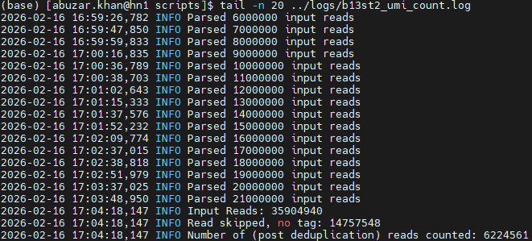

**Input Reads:** 35,904,940 reads are aligned reads provided to UMI-tools.

**Read skipped, no tag:** 14,757,548 reads lacked proper gene assignment or required tags.

**Post-deduplication reads counted:** 6,224,561

This means that approximately 6.2 million unique molecules were detected and further signifies that a large proportion of reads were PCR duplicates and collapsed. This is expected in scRNA-seq datasets.

**Preview of Final Count Matrix**

```r
zcat /path/to/b13st2_counts_transcript.tsv.gz | head -n 3 | awk 'NR==1{print $1"\t"$2"\t"$3} NR&gt;1{split($1,a,","); print a[1]"\t"$2"\t"$3' | column -t
```

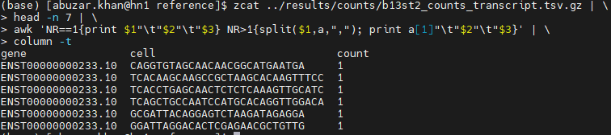

**Understanding the Columns**

| ***Column*** | ***Description***          |
|--------------|----------------------------|
| gene         | Transcript ID(s)           |
| cell         | Cell barcode               |
| count        | Number of unique molecules |

Each row represents one transcript detected in one cell with its UMI-collapsed count.

**Number of Detected cells**

| zcat b13st2_counts_transcript.tsv.gz \| cut -f2 \| sort \| uniq \| wc -l |
|--------------------------------------------------------------------------|

**Example output:**

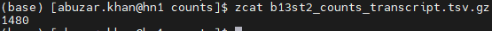

This indicates that around 1,480 unique cell barcodes were detected in the final matrix which represent high-confidence cells after filtering and deduplication.

**Interpretation of Results**

| **Metric**           | **Observed Value** | **Interpretation**            |
|----------------------|--------------------|-------------------------------|
| Input reads          | 35.9M              | Reads aligned to genome       |
| Molecules counted    | 6.2M               | Unique RNA molecules          |
| Final cells detected | 1,480              | High-confidence cell barcodes |

**The generated count matrices will next be imported to Seurat for downstream analysis**
