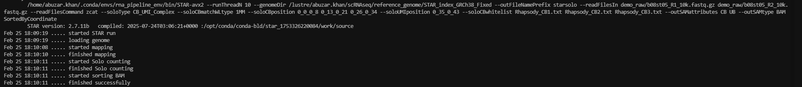
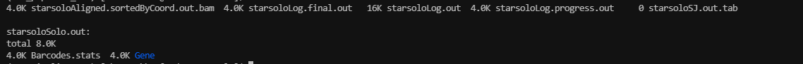

<table>
<colgroup>
<col style="width: 100%" />
</colgroup>
<thead>
<tr class="header">
<th><h1 id="module-4-preprocessing-and-alignment-of-scrna-seq-data"><strong>Module 4: Preprocessing and Alignment of scRNA-Seq Data</strong> </h1></th>
</tr>
</thead>
<tbody>
</tbody>
</table>

## **1. Overview of the Workflow**


| FASTQ -> QC -> Whitelist -> UMI Extraction -> STAR -> featureCounts -> UMI Count |
|----------------------------------------------------------------------------------|

## **2. Quality Filtering using fastp**

Before proceeding to barcode processing and alignment, it is essential to evaluate and clean the sequencing reads. Although modern sequencers produce high-quality data, technical artifacts such as low-quality bases and very short reads may still be present. Removing such artifacts improves downstream alignment performance and reduces noise.

In single-cell RNA-seq:

- Read 1 (R1) contains Cell Barcode + UMI

- Read 2 (R2) contains transcript sequence

The cell barcodes are unique sequences which help us identify cells and tag them from our samples, whereas UMI helps us tag every RNA molecule uniquely. Care must be taken not to aggressively trim R1, as it contains structured barcode information.

**fastp command**

```r
fastp \
--in1 /path/to/read1/input/file/<WTA_SAMPLE1_R1.fastq.gz> \
--in2 /path/to/read2/input/file/<WTA_SAMPLE1_R2.fastq.gz> \
--out1 /path/to/<WTA_SAMPLE1_R1.fastp.fastq.gz> \
--out2 /path/to/<WTA_SAMPLE1_R2.fastp.fastq.gz> \
--length_required 20 \
--qualified_quality_phred 15 \
--thread 12 \
--html /logs/WTA_fastp.html \
--json /logs/WTA_fastp.json
```

| **fastp Parameters**         |                                                     |
|------------------------------|-----------------------------------------------------|
| ***Parameter***              | ***Description***                                   |
| --in1                        | Input FASTQ file for Read 1 (Cell Barcode + UMI)    |
| --in2                        | Input FASTQ file for Read 2 (Transcript read)       |
| --out1                       | Output cleaned Read 1 file                          |
| --out2                       | Output cleaned Read 2 file                          |
| --length_required 20         | Discards reads shorter than 20 bases after trimming |
| --qualified_quality_phred 15 | Bases below Q15 are considered low quality          |
| --thread 12                  | Number of CPU threads used                          |
| --html                       | Generates interactive quality control report        |
| --json                       | Generates machine-readable summary statistics       |

### 

### 

### 

### 

**Why Use Q15?**

In bulk RNA-seq, stricter thresholds (Q20 or Q30) are often used. However, in single-cell RNA-seq, over-trimming can remove biologically relevant reads while some reads may be shorter due to fragmentation. Therefore, a slightly permissive threshold preserves sensitivity.

**Evaluating fastp result**

After execution, summary statistics can be extracted from the json report:

```r
grep "total_reads" <WTA_fastp.json>
grep "q20_rate" <WTA_fastp.json>
```

**Output generated:**

The HTML report can be opened in a browser for detailed visualization of per-base quality, Adapter content, GC distribution and Sequence duplication levels.

**Note:** *For this study we have used sample b13st2.*


Quality filtering ensures that the barcode extraction is reliable and improves alignment accuracy.

Importantly, we avoid aggressive trimming to preserve cell barcode and UMI sequences that are present in the reads.

**Total Reads**

> Initial reads: **100,364,778**
> Post-filtering reads: **100,363,522**

**Understanding the fastp HTML Report**

After running fastp, an interactive quality control report is generated. This report helps us evaluate sequencing quality before alignment. The HTML report also shows per-base quality plots for Read 1 and Read 2.

**What These Plots Show**

- X-axis → position in read

- Y-axis → quality score

- Black line → mean quality


In our sample, R1 shows high quality in early positions, followed by a slight drop near the end (expected in scRNA-seq), whereas R2 shows gradual decline toward 3′ end (normal).

***NOTE:** A gradual quality drop at the end of reads is normal, while sudden sharp drop early in the read would be concerning.*

***Read 1*** quality before and after filtering as depicted below:

  

***Read 2*** quality before and after filtering as depicted below:

  

**\# Final Quality Assessment**

This dataset shows high base quality with Q30 values above 80%, with minimal adapter contamination and low duplication rate.

## **3. Alignment using STAR**

**Reference Genome and Annotation Preparation**

Before performing alignment, a reference genome and corresponding gene annotation file are required.

STAR uses:

- **Genome FASTA** → for sequence alignment

- **GTF annotation file** → for splice junction and gene feature information

It is critical that both files originate from the **same release version** to avoid coordinate mismatches during gene assignment.

In this module, we use (GENCODE Release 49, GRCh38 primary assembly)

**Downloading the Reference Files**

### **Genome FASTA**

```r
wget -P /path/to/fasta \
https://ftp.ebi.ac.uk/pub/databases/gencode/Gencode_human/release_49/GRCh38.primary_assembly.genome.fa.gz
gunzip /path/to/GRCh38.primary_assembly.genome.fa.gz
```

**Example Command**

```r
wget -P ../reference/fasta \
https://ftp.ebi.ac.uk/pub/databases/gencode/Gencode_human/release_49/GRCh38.primary_assembly.genome.fa.gz
gunzip ../reference/fasta/GRCh38.primary_assembly.genome.fa.gz
```

**Gene Annotation (GTF)**

```r
wget -P /path/to/gtf \
https://ftp.ebi.ac.uk/pub/databases/gencode/Gencode_human/release_49/gencode.v49.annotation.gtf.gz
gunzip /path/to/gencode.v49.annotation.gtf.gz
```

**Example Command**

```r
wget -P ../reference/gtf \
https://ftp.ebi.ac.uk/pub/databases/gencode/Gencode_human/release_49/gencode.v49.annotation.gtf.gz
gunzip ../reference/gtf/gencode.v49.annotation.gtf.gz
```

# 

# **Building the STAR Genome Index**

Before aligning sequencing reads, STAR requires a pre-built genome index. The genome index is a searchable data structure derived from reference genome FASTA file and gene annotation (GTF) file

This index enables:

- Fast alignment

- Accurate splice junction detection

- Efficient memory usage during alignment

**Note:** *Genome indexing is performed **only once per genome build** and reused for all samples. It important that FASTA and GTF must originate from the same release*

**Indexing**

```r
STAR \
--runThreadN 12 \
--runMode genomeGenerate \
--genomeDir /path/to/star_index \
--genomeFastaFiles /path/to/fasta/GRCh38.primary_assembly.genome.fa \
--sjdbGTFfile /path/to/gtf/gencode.v49.annotation.gtf \
--sjdbOverhang 149
```

**Example Indexing command**

```r
STAR \
--runThreadN 12 \
--runMode genomeGenerate \
--genomeDir ../reference/star_index \
--genomeFastaFiles ../reference/fasta/GRCh38.primary_assembly.genome.fa \
--sjdbGTFfile ../reference/gtf/gencode.v49.annotation.gtf \
--sjdbOverhang 149
```

| **STAR Parameters (for creating Genome Index)** |                                                            |
|-------------------------------------------------|------------------------------------------------------------|
| ***Parameter***                                 | ***Description***                                          |
| --runThreadN 12                                 | Number of CPU threads used for indexing                    |
| --runMode genomeGenerate                        | Tells STAR to build genome index instead of aligning reads |
| --genomeDir                                     | Directory where index files will be stored                 |
| --genomeFastaFiles                              | Reference genome FASTA file                                |
| --sjdbGTFfile                                   | Gene annotation file (must match genome version)           |
| --sjdbOverhang 149                              | Read length − 1 (for 150 bp reads)                         |

**Why Use --sjdbOverhang 149?**

If sequencing read length is 150 bp:

*150−1=149*

This parameter improves splice junction detection by informing STAR of the maximum read overhang across exon junctions. Using the correct value improves alignment accuracy for spliced transcripts.

**Output Files Generated**

After successful indexing, the following directory is created: “reference/star_index/” in the example.

| ls ../reference/star_index/ |
|-----------------------------|

**Expected output:**


The generated files include:

- **Genome** → Encoded reference genome

- **SA / SAindex** → Suffix array structures for fast searching

- **sjdbList.fromGTF.out.tab** → Splice junction database

- **transcriptInfo.tab** → Transcript-level metadata

These files collectively form the STAR genome index. The total directory size is typically:

~30–35 GB for GRCh38 primary assembly This confirms successful genome indexing and integration of annotation into index.

**Alignment of Transcript Reads Using STAR**

After extracting valid transcript reads (R2) and attaching cell barcode and UMI information to the read headers, the next step is to align these reads to the human reference genome.

In BD Rhapsody data

- R1 contains barcode and UMI (already processed)

- R2 contains transcript sequence and is used for alignment

**Note:** We will be using the whitelist generated previously in Module 1 using umi tools in the following steps of Alignment. Kindly refer to Module 1 for detailed steps along with codes if your data requires Whitelist file generation after demultiplexing.

**STAR Alignment**

```r
#Aligning BD Rhapsody WTA data
STAR --runThreadN 12 \
--genomeDir /path/to/STAR/ \
--readFilesIn <Sample>_R2.fastq.gz <Sample>_R1.fastq.gz \
--readFilesCommand zcat \
--soloType CB_UMI_Complex \
--soloCBmatchWLtype 1MM \
--soloCBposition 0_0_0_8 0_13_0_21 0_26_0_34 \
--soloUMIposition 0_35_0_43 \
--soloCBwhitelist Rhapsody_CB1.txt Rhapsody_CB2.txt Rhapsody_CB3.txt \
--outFileNamePrefix ./star_solo \
--outSAMattributes CB UB \
--outSAMtype BAM SortedByCoordinate
--limitBAMsortRAM 60000000000
```

**Example Star Alignment** :

```r
STAR --runThreadN 12 \
--genomeDir reference/star_index \
--readFilesIn b08st05_R2_10k.fastq.gz b08st05_R1_10k.fast \
--readFilesCommand zcat \
--soloType CB_UMI_Complex \
--soloCBmatchWLtype 1MM \
--soloCBposition 0_0_0_8 0_13_0_21 0_26_0_34 \
--soloUMIposition 0_35_0_43 \
--soloCBwhitelist Rhapsody_CB1.txt Rhapsody_CB2.txt Rhapsody_CB3.txt \
--outFileNamePrefix ./star_solo \
--outSAMattributes CB UB \
--outSAMtype BAM SortedByCoordinate
--limitBAMsortRAM 60000000000
```

| **STAR Parameters (for alignment)** |                                                  |
|-------------------------------------|--------------------------------------------------|
| ***Parameter***                     | ***Description***                                |
| --runThreadN 12                     | Number of CPU threads used for alignment         |
| --genomeDir                         | Path to previously built STAR genome index       |
| --readFilesIn                       | Input transcript FASTQ file (R2)                 |
| --readFilesCommand zcat             | Decompress gzipped FASTQ on-the-fly              |
| --outFileNamePrefix                 | Directory and prefix for output files            |
| --outSAMtype BAM SortedByCoordinate | Output sorted BAM file directly                  |
| --twopassMode Basic                 | Improves splice junction detection               |
| --soloType CB_UMI_Complex                        | Activates complex barcode mode (use CB_UMI_Simple for simple barcodes) |
| --soloCBposition 0_0_0_8 0_13_0_21 0_26_0_34     | Defines positions of 3 barcode segments on the read (format: startAnchor_startDistance_endAnchor_endDistance). <br>• 0_0_0_8 → first 9 bases <br>• 0_13_0_21 → bases 13–21 (9 bp) <br>• 0_26_0_34 → bases 26–34 (9 bp) |
| --soloUMIposition 0_35_0_43                      | Defines UMI position on the read (8 bp UMI following third barcode block) |
| --soloCBwhitelist CL1S.txt CL2S.txt CL3S.txt     | Specifies whitelist files for barcode segments (CLS1–3 from BD Rhapsody barcode structure; one barcode per line, no header) |
| --soloCBmatchWLtype 1MM                          | Allows up to 1 mismatch between detected barcode and whitelist |
| --outSAMattributes CB UB                         | Adds corrected Cell Barcode (CB) and UMI (UB) tags to BAM output |
| --outSAMtype BAM SortedByCoordinate              | Outputs coordinate-sorted BAM file (required when using --outSAMattributes) |
| --limitBAMsortRAM                   | Prevents excessive memory use during BAM sorting |

**Execution:**



**Example output files:**



| **STARsolo Output Files**                  |                                                  |
|--------------------------------------------|--------------------------------------------------|
| ***File Name***                            | ***Description***                                |
| Aligned.sortedByCoord.out.bam              | Coordinate-sorted BAM file containing aligned reads with CB (cell barcode) and UB (UMI) tags (if enabled). |
| Log.out                                    | Complete run log showing STAR execution details, parameter settings, and runtime information. |
| Log.final.out                              | Summary statistics of alignment (mapping rate, uniquely mapped reads, multimappers, etc.). |
| Log.progress.out                           | Real-time progress report generated during alignment (useful for monitoring long runs). |
| SJ.out.tab                                 | Detected splice junctions from alignment (useful for splicing analysis or QC). |
| Solo.out/                                  | Directory containing STARsolo gene expression outputs (matrix.mtx, barcodes.tsv, features.tsv, filtering results, etc.). |

**Interpretation of Results**

Solo.out/
└── Gene/
    ├── raw/
    │   ├── matrix.mtx
    │   ├── barcodes.tsv
    │   ├── features.tsv
    ├── Features.stats
    ├── Summary.csv
    ├── UMIperCellSorted.txt

**The following generated matrices will next be imported to Seurat for downstream analysis**

| ***File Name*** | ***Description*** |
|-----------------|------------------|
| matrix.mtx      | Sparse gene-by-cell count matrix in Matrix Market format (rows = genes, columns = cell barcodes, values = UMI counts). |
| barcodes.tsv    | List of detected cell barcodes corresponding to matrix columns (one barcode per line). |
| features.tsv    | Gene annotation file corresponding to matrix rows (typically includes gene ID, gene name, and feature type). |


